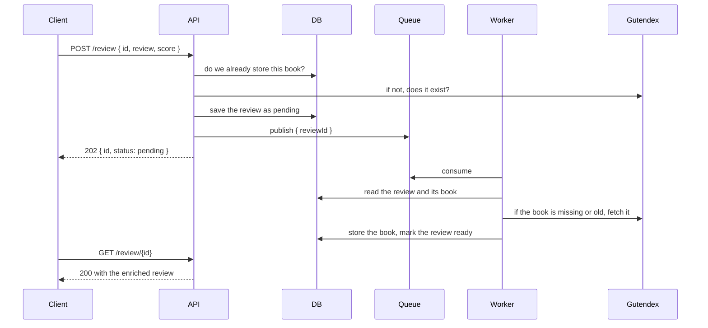
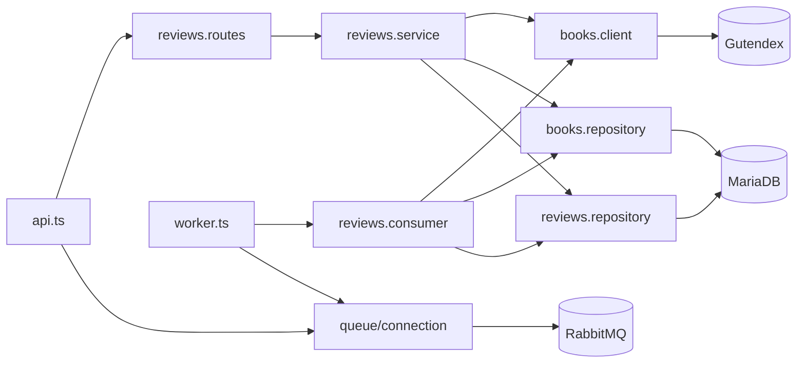

# Book review service

A REST API to search books on [Gutendex](https://gutendex.com) and review them. Posting a review
does not wait for Gutendex: the review is saved right away and a background worker fills in the
book details a moment later.

## How it works



The API and the worker are two processes from the same codebase, and they never call each other:
they share the database and the queue. The API keeps accepting reviews while the worker is down,
and the backlog is picked up when it comes back.

## Components



**`api.ts`** — builds the Fastify app, registers the error handler and the routes, and injects the
publisher into them. Handles `SIGTERM` by draining requests and closing the queue and the pool.

**`worker.ts`** — opens the AMQP channel, consumes with five messages in flight, and decides
whether each one is acknowledged or dead lettered. Contains no business logic.

**`reviews.routes.ts`** — parses the request with Zod, calls the service, formats the response.
It receives the publisher as an option, so it knows nothing about RabbitMQ.

**`reviews.service.ts`** — the rules: check the book, store the review, publish, update, delete.
Speaks in reviews and typed errors, never in requests or status codes.

**`reviews.consumer.ts`** — what to do with one message: reload the review, fetch the book if it
is missing or stale, mark the review ready. Knows nothing about AMQP, so it can be tested alone.

**`books.client.ts`** — the only place that talks to Gutendex, with a timeout on every call, plus
the mapper from their payload to ours.

**`books.repository.ts` / `reviews.repository.ts`** — the only places that touch tables.

**`queue/connection.ts`** — connection, channel, and the declaration of exchanges, queues and
bindings. Both processes declare the same topology, so start order does not matter.

**`http/errors.ts`** — the typed error and the single handler that turns anything thrown into a
response.

## Where a request can end up

Everything the HTTP layer answers is in the OpenAPI document on `/docs`. This is what happens
behind it.

| situation | review row | queue message | what the client sees |
|---|---|---|---|
| payload fails validation | not created | none | `400` with the offending fields |
| unknown book id | not created | none | `404` |
| Gutendex slow or down during the `POST` | not created | none | `500` |
| queue unreachable | created, then removed | none | `503`, safe to retry |
| enrichment succeeds | `ready` | acknowledged | `200` with the book |
| book gone from Gutendex | `failed` + reason | acknowledged | `200`, status `failed` |
| Gutendex or database fails in the worker | `failed` + reason | dead lettered | `200`, status `failed` |
| message is not valid JSON | untouched | dead lettered | nothing |
| review deleted before enrichment | already gone | acknowledged | `404` |

A `404` from Gutendex is final, so the message is acknowledged rather than kept: retrying would
produce the same answer. Anything else may be temporary, so the message is preserved in
`reviews.enrich.dlq` for inspection.

## Data

`reviews` holds a uuid, the Gutendex `book_id`, the text, the score, a status of `pending`,
`ready` or `failed`, and a `failure_reason`.

`failure_reason` is filled only when the status is `failed`, and it is not a closed set. One value
is written on purpose:

- `book <id> is no longer available` — Gutendex answered `404`, the message was acknowledged
- `fetch failed` — Gutendex was unreachable
- `The operation was aborted due to timeout` — it did not answer within ten seconds
- `gutendex lookup failed with 503` — it answered, with an error
- a driver message when the database was the problem, or `unknown error` for anything that was
  not an `Error`

All of these leave the message in the dead letter queue.

`books` holds one row per Gutendex book, keyed by its id, with a `fetched_at` timestamp that makes
the copy expire. The same book reviewed a hundred times is fetched and stored once.

`book_id` is not a foreign key on purpose: the review is written before the book exists, since
fetching it is the worker's job, so the constraint would reject the first review of every book.

## Endpoints

- `GET /book/search?q=` search Gutendex, returns id, title, authors and cover
- `POST /review` create a review, returns `202` with the id to poll
- `GET /review/{id}` `202` while pending, `200` once enriched
- `PUT /review/{id}` update score and review text (does not re-enrich)
- `DELETE /review/{id}` returns `204`

Scores are whole numbers from 1 to 10, the review text 10 to 2000 characters once trimmed, and the
search query at least 2 characters. A review points at a Gutendex id and not at a title, so the
search comes first: the same title often has several editions, and picking one is the caller's
choice.

The full reference is served by the API itself: Swagger UI on `/docs`, the raw document on
`/openapi.json`.

## Configuration

Copy `.env.example` to `.env`. The application reads five variables, and the process exits at
startup if one is missing or malformed:

| variable | meaning |
|---|---|
| `PORT` | port the API listens on, defaults to 3000 |
| `DATABASE_URL` | MySQL connection string |
| `RABBITMQ_URL` | AMQP connection string |
| `GUTENDEX_URL` | base url of the catalogue API |
| `BOOK_MAX_AGE_DAYS` | how long a stored book is reused before being fetched again, defaults to 30 |

The rest of `.env.example` is only read by Docker Compose to create the containers.

## Commands

```bash
docker compose up -d       # database, queue, migrations, api and worker
npm test                   # needs the database from compose to be up
npm run lint
npm run build
```

The API is on http://localhost:3001, RabbitMQ on http://localhost:15672.

To run the two processes outside of Docker, in separate terminals:

```bash
docker compose up -d db rabbitmq
npm install
npm run db:migrate
npm run dev
npm run dev:worker
```

## Limitations

Stored books are reused for `BOOK_MAX_AGE_DAYS` and nothing checks in between whether they changed
or disappeared, so a copy can be out of date. Adding a refresh job would mean a scheduler and a
conflict policy.

If a book is removed from Gutendex, the reviews pointing at it keep the last data we have.

Enrichment is not retried: a failure leaves the message in the dead letter queue, to be
republished by hand. Requeueing automatically would spin the same message while Gutendex is down.

There are no users, so a book can collect any number of reviews and nothing ties one to an author.
