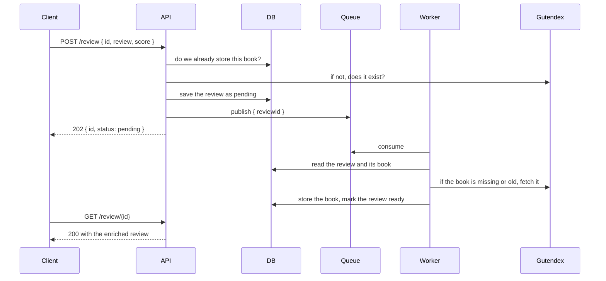

# Book review service

A REST API to search books on [Gutendex](https://gutendex.com) and review them. Posting a review
does not wait for Gutendex: the review is saved right away and a background worker fills in the
book details a moment later.

## How it works



The API and the worker are two processes from the same codebase. They never call each other: they
share the database and the queue. That means the API keeps accepting reviews while the worker is
down, and the backlog is picked up when it comes back.

The message on the queue carries nothing but the review id. The worker reads the row itself, so
the payload stays small and, more importantly, it always works on the current version of the
review, even if a `PUT` changed it in the meantime.

Books live in their own table, keyed by the Gutendex id, and are fetched once and reused by every
review that points at them. So the first review of a book costs a call to Gutendex, and the ones
after it cost nothing until the stored copy grows older than `BOOK_MAX_AGE_DAYS`.

A review is `pending` until the worker enriches it, then `ready`. If the book is gone from
Gutendex the review is marked `failed` with a reason, and the message is acknowledged, since
retrying would only produce the same answer. If instead something breaks along the way, the review
is also marked `failed` but the message is moved to a dead letter queue, where it can be inspected
and replayed by hand.

## Endpoints

- `GET /book/search?q=` search Gutendex, returns id, title, authors and cover
- `POST /review` create a review, returns `202` with the id to poll
- `GET /review/{id}` `202` while pending, `200` once enriched
- `PUT /review/{id}` update score and review text (does not re-enrich)
- `DELETE /review/{id}`

The body of a `POST` is `{ "id": "2701", "review": "...", "score": 8 }`, where `id` is the
Gutendex book id, not a title, so search first and pick one of the results. A `PUT` takes the same
body without the `id`.

Scores go from 1 to 10, the review text from 10 to 2000 characters. Full reference on `/docs`.

## Known limitations

Books are stored once, keyed by their Gutendex id, and reused by every review that points at
them. A copy is considered good for `BOOK_MAX_AGE_DAYS`, thirty by default, after which the worker
fetches it again. There is
no background job checking whether a book changed or disappeared in the meantime, so between two
fetches the stored copy can be out of date. Adding one would mean a scheduler and a policy for
conflicts, which felt out of scope here.

If a book is removed from Gutendex, the reviews pointing at it are kept with the last data we
have, and any new review for it fails with a reason. Deleting the reviews along with the book, or
silently re-pointing them at another edition, would both destroy or misrepresent what someone
wrote.

Enrichment is not retried. A failure leaves the review marked `failed` and the message in the dead
letter queue, where it can be inspected and republished by hand. Automatic requeueing would spin
the same message in a tight loop for as long as Gutendex is down.

There are no users, so a book can collect any number of reviews and nothing ties a review to
whoever wrote it.

## Commands

Copy `.env.example` to `.env` first.

```bash
docker compose up -d       # database, queue, migrations, api and worker
npm test                   # needs the database from compose to be up
npm run lint
npm run build
```

The API is on http://localhost:3001, RabbitMQ on http://localhost:15672.

To run the two processes outside of Docker, in separate terminals:

```bash
docker compose up -d db rabbitmq
npm install
npm run db:migrate
npm run dev
npm run dev:worker
```
